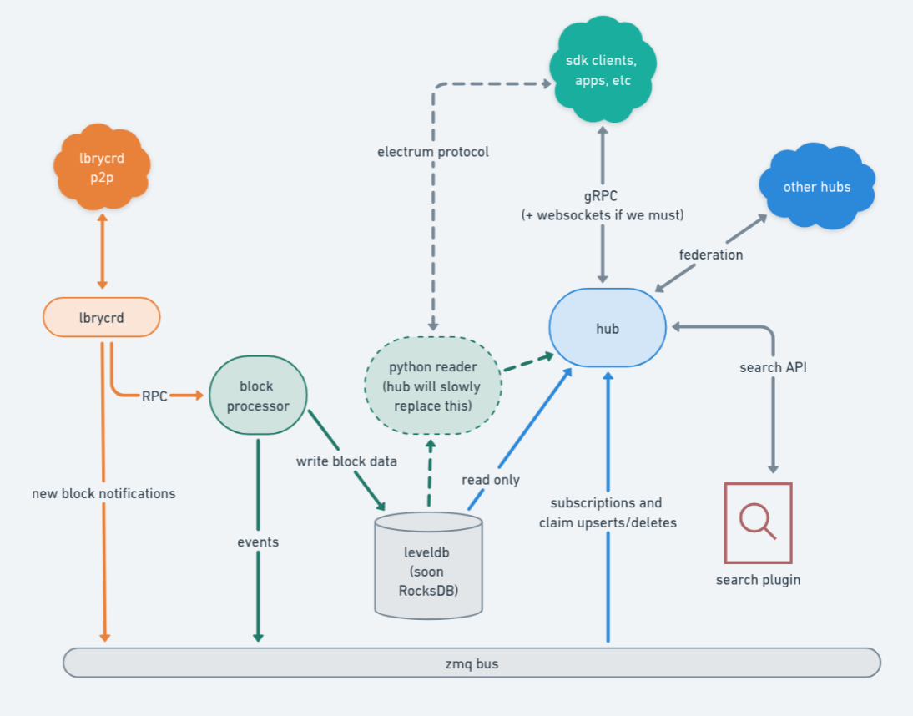

# LBRY Hub

A hub provides back-end services to LBRY clients. Services include

- URL resolution
- search
- wallet services (getting and sending transactions, address subscription)
- hub federation and discovery

This project will eventually subsume and replace the
[wallet server](https://github.com/lbryio/lbry-sdk/blob/v0.92.0/docker/Dockerfile.wallet_server)
and the [lighthouse](https://github.com/lbryio/lighthouse) search provider.



## Installation

No install instructions yet. See Contributing below.

## Usage

### Prerequisite: run python block processor and search plugin

Follow the instructions [here](https://lbry.tech/resources/wallet-server).

### Run this hub

```bash
./hub serve
```

### Search for stuff

```bash
./hub search text goes here
```

## Contributing

Contributions to this project are welcome, encouraged, and compensated. Details [here](https://lbry.tech/contribute).

### Dev Dependencies

Install Go 1.14+

- Ubuntu: `sudo add-apt-repository ppa:longsleep/golang-backports && sudo apt install golang-go`
- OSX: `brew install go`
- Windows https://golang.org/doc/install

Download `protoc` from https://github.com/protocolbuffers/protobuf/releases and make sure it is
executable and in your path.

Install Go plugin for protoc and python:

```
go get google.golang.org/protobuf/cmd/protoc-gen-go google.golang.org/grpc/cmd/protoc-gen-go-grpc
pip install grpcio grpcio-tools github3.py
```

Lastly the hub needs protobuf version 3.17.1, it may work with newer version but this is what it's built with, on ubuntu systems you'll have to install this from source see the GitHub actions in `.github/workflows` for an example of this.

Install rocksdb and setup your CGO flags, on ubuntu

```
sudo apt-get install libgflags-dev libsnappy-dev zlib1g-dev libbz2-dev libzstd-dev liblz4-dev
export CGO_CFLAGS="-I/path/to/rocksdb/include"
export CGO_LDFLAGS="-L/path/to/rocksdb -lrocksdb -lstdc++ -lm -lz -lsnappy -llz4 -lzstd -lbz2"
```

```
https://github.com/protocolbuffers/protobuf/releases/download/v3.17.1/protobuf-all-3.17.1.tar.gz
```

If you can run `./protobuf/build.sh` without errors, you have `go` and `protoc` installed correctly. 

Finally, run the block processor as described under Usage.

### Running from Source

Run `./dev.sh` to start the hub. The script will restart the hub as you make changes to `*.go` files. 

To search, use `go run . search text goes here`.

#### Windows

reflex doesn't work on windows, so you'll need to run `go run . serve` and restart manually as you make changes.

## License

This project is MIT licensed. For the full license, see [LICENSE](LICENSE).

## Security

We take security seriously. Please contact security@lbry.com regarding any security issues. [Our PGP key is here](https://lbry.com/faq/pgp-key) if you need it.

## Contact

The primary contact for this project is [@lyoshenka](https://github.com/lyoshenka) ([grin@lbry.com](mailto:grin@lbry.com)).
